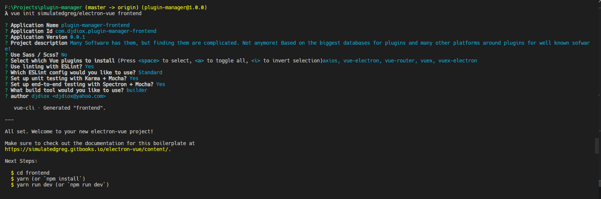
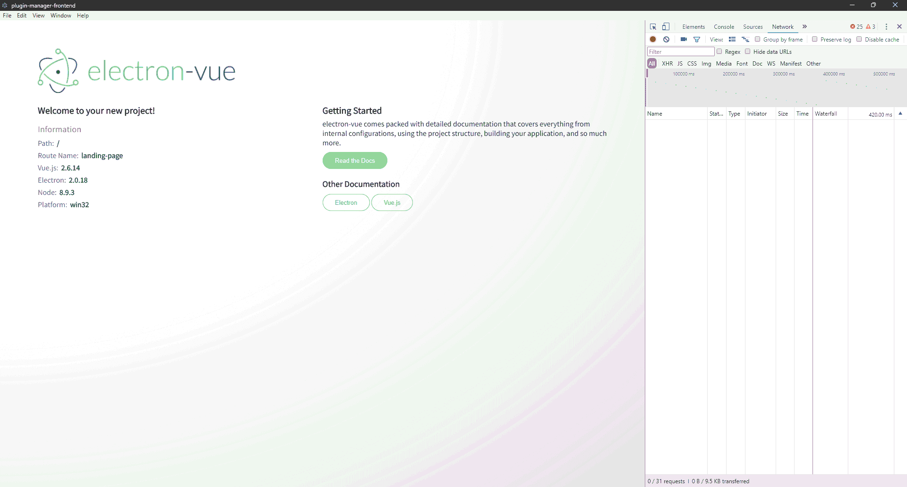

# Plugin Manager (multi-os)

## Fresh Setup Electron Frontend
1. Setup nodejs with LTS Version via www.nodejs.org
2. Install [YARN](https://yarn.org)
3. Install Vue-CLI

``` sh
# Install vue-cli and scaffold boilerplate
npm install -g vue-cli
```

## Variant No. 1

[using the dedicated builder: ](https://github.com/nklayman/vue-cli-plugin-electron-builder)
``` bash
vue create frontend
vue add vuetify
vue add electron-builder
npm install -D @types/node@">=12.0.0 <13.0.0"
cd frontend &6 npm run serve
```


## Variant No. 2

[using the boilerplate from SimulatedGREG](https://github.com/SimulatedGREG/electron-vue)
``` sh
# Initialize 
vue init simulatedgreg/electron-vue my-project

# Install dependencies and run your app
cd frontend
yarn # or npm install
yarn run dev # or npm run dev
```
**ATTENTION: Do not use SCSS in this boilerplate, install it after setting up the project**

**Prefer Yarn over NPM, might throws random ero**

[Detailed Documentation](https://simulatedgreg.gitbooks.io/electron-vue/content/en/)



